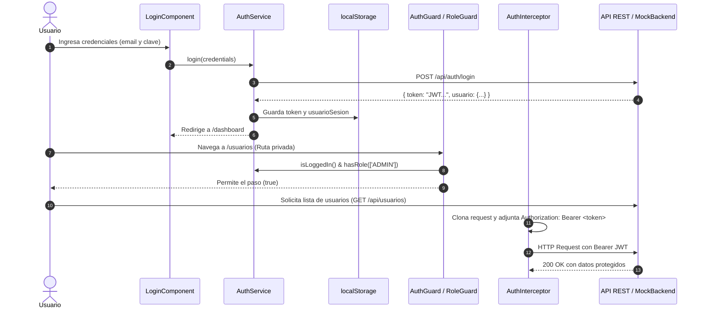

# 🎓 IDAT PORTAL - SISTEMA DE GESTIÓN DE CURSOS Y USUARIOS (ANGULAR + JWT)

> **Evaluación Final - Unidad Didáctica: Desarrollo de Interfaces 3**  
> **Modalidad:** Grupal (3 integrantes)  
> **Tecnologías:** Angular 20, TypeScript, RxJS, JWT, Express / SSR, Bootstrap & CSS Modular  
> **Calificación Objetivo:** Sobresaliente (20 / 20 puntos)

---

## 📌 1. Descripción del Proyecto

El **Sistema de Gestión Académica Idat** es una Single Page Application (SPA) de nivel empresarial desarrollada en **Angular** y **TypeScript**, diseñada para centralizar la gestión de cursos, docentes y estudiantes con altos estándares de seguridad, enrutamiento avanzado, modularidad y control de accesos basado en roles (**RBAC - Role-Based Access Control**).

### 🎯 Logros Cumplidos según la Rúbrica de Evaluación

| Criterio Evaluado | Nivel Alcanzado | Evidencias Implementadas en el Código |
| :--- | :---: | :--- |
| **1. Buenas Prácticas y POO** | **Sobresaliente (4 pts)** | Arquitectura modular escalable, separación de capas (`core`, `shared`, `pages`), modelos fuertemente tipados con interfaces DTOs, **Directiva estructural personalizada (`*appHasRole`)** y **3 Pipes personalizados propios (`appEstado`, `appRol`, `appFiltroBusqueda`)**. |
| **2. Implementación de Rutas** | **Sobresaliente (4 pts)** | Enrutamiento SPA con rutas públicas (`/login`), privadas (`/dashboard`, `/cursos`, `/usuarios`), jerarquía con layout anidado (`Navbar` + `Sidebar`), redirecciones inteligentes y manejo de errores HTTP 403 (`/forbidden`) y 404 (`/not-found` vía `**`). |
| **3. Implementación de Guards** | **Sobresaliente (4 pts)** | Múltiples Guards funcionales: **`AuthGuard`** (protección de sesión y token), **`RoleGuard`** (control granular por roles autorizados en `data.roles`) y **`LoginGuard`** (evita volver al login si la sesión ya está activa). |
| **4. Integración con APIs REST** | **Sobresaliente (4 pts)** | Servicios Angular dedicados (`AuthService`, `CursoService`, `UsuarioService`, `MockBackendService`) con operaciones completas `GET`, `POST`, `PUT` y `DELETE`, programación reactiva con **Observables RxJS**, `BehaviorSubject` para reactividad de sesión y manejo centralizado de excepciones con `catchError`. |
| **5. Autenticación con Token JWT** | **Sobresaliente (4 pts)** | Almacenamiento seguro del token en `localStorage`, **`AuthInterceptor`** que inyecta automáticamente la cabecera `Authorization: Bearer <token>` en cada petición HTTP, y control global de expiración de sesión y respuestas `401 Unauthorized` / `403 Forbidden`. |

---

## 🔑 2. Credenciales de Prueba y Acceso Rápido

Para facilitar la evaluación y demostración de las funcionalidades, el formulario de Login incluye botones de **Acceso Rápido** para autenticarse automáticamente con cualquiera de los tres roles definidos en la rúbrica:

| Rol | Correo Institucional | Contraseña | Permisos y Alcance en el Sistema |
| :--- | :--- | :--- | :--- |
| **ADMINISTRADOR** | `admin@idat.edu.pe` | `admin123` | **Acceso Total:** Dashboard con métricas globales, Gestión completa de Usuarios (CRUD), Gestión completa de Cursos (Crear, Editar, Eliminar). |
| **DOCENTE / PROFESOR** | `profesor@idat.edu.pe` | `prof123` | **Acceso Académico:** Dashboard docente con asignaturas asignadas, Gestión de Cursos (Crear y Editar). Bloqueado por `RoleGuard` para la gestión de usuarios (`/usuarios` redirige a `/forbidden`). |
| **ESTUDIANTE / ALUMNO** | `estudiante@idat.edu.pe` | `est123` | **Acceso de Consulta:** Dashboard de alumno, Catálogo interactivo de Cursos y acción de Matrícula en tiempo real. Sin privilegios de edición o administración. |

---

## 🏛️ 3. Estructura y Arquitectura del Proyecto

```text
src/app/
├── core/                               # Núcleo de la aplicación (Singleton / Global)
│   ├── guards/                         # Guards de navegación y seguridad
│   │   ├── auth.guard.ts               # Verifica sesión y token activo en localStorage
│   │   ├── role.guard.ts               # Restringe rutas por roles (ADMIN, PROFESOR, etc.)
│   │   └── login.guard.ts              # Redirige a /dashboard si ya hay una sesión activa
│   ├── interceptors/                   # Interceptores HTTP
│   │   └── auth.interceptor.ts         # Inyecta Bearer <token> y gestiona errores 401/403
│   ├── models/                         # Modelos e Interfaces TypeScript (POO)
│   │   ├── auth.model.ts               # LoginRequest, AuthResponse, UserRole
│   │   ├── curso.model.ts              # Curso, CursoCreateDto, CursoUpdateDto
│   │   └── usuario.model.ts            # Usuario, UsuarioCreateDto, UsuarioUpdateDto
│   └── services/                       # Servicios de lógica de negocio y HTTP
│       ├── auth.service.ts             # Gestión de JWT, sesión y BehaviorSubject
│       ├── curso.service.ts            # CRUD de Cursos con Observables RxJS
│       ├── usuario.service.ts          # CRUD de Usuarios con Observables RxJS
│       └── mock-backend.service.ts     # Mock REST API con generación de JWT y persistencia
│
├── shared/                             # Componentes, pipes y directivas reutilizables
│   ├── components/
│   │   ├── navbar/                     # Barra superior con avatar, datos de usuario y logout
│   │   └── sidebar/                    # Menú lateral dinámico según el rol autenticado
│   ├── directives/
│   │   └── has-role.directive.ts       # Directiva estructural *appHasRole
│   └── pipes/
│       ├── estado.pipe.ts              # Pipe appEstado (Activo / Inactivo / Badges)
│       ├── rol.pipe.ts                 # Pipe appRol (Administrador / Docente / Estudiante)
│       └── filtro-busqueda.pipe.ts     # Pipe appFiltroBusqueda (Filtro reactivo por propiedades)
│
├── pages/                              # Vistas / Páginas de la SPA
│   ├── login/                          # Formulario reactivo con selector rápido de roles
│   ├── dashboard/                      # Panel principal con KPIs y widgets personalizados por rol
│   ├── cursos/                         # Tabla reactiva, modal CRUD, filtros y matrículas
│   ├── usuarios/                       # CRUD completo de usuarios (Acceso exclusivo Admin)
│   ├── forbidden/                      # Vista 403 (Acceso Denegado / Sin permisos)
│   └── not-found/                      # Vista 404 (Página No Encontrada)
│
├── app-routing-module.ts               # Definición y configuración de rutas SPA con Guards
├── app-module.ts                       # Registro de módulos, providers e interceptors
├── app.html & app.ts                   # Layout maestro con enrutador condicional y navegación
└── styles.css                          # Sistema de diseño, temas visuales y variables CSS
```

---

## 🛡️ 4. Flujo de Autenticación, Seguridad y Guards



---

## 🛠️ 5. Pipes y Directivas Personalizadas de Creación Propia

### 1. Directiva Estructural `*appHasRole`
Permite ocultar o mostrar elementos del DOM de forma declarativa según el rol del usuario autenticado:
```html
<!-- Visible solo para Administradores y Docentes -->
<button *appHasRole="['ADMIN', 'PROFESOR']" (click)="abrirModalCrear()">
  Nuevo Curso
</button>

<!-- Visible exclusivamente para Administradores -->
<div *appHasRole="['ADMIN']">
  <a routerLink="/usuarios">Gestión de Usuarios</a>
</div>
```

### 2. Pipe `appEstado`
Formatea estados booleanos en etiquetas legibles o clases CSS de badges:
```html
<span class="badge" [ngClass]="curso.estado | appEstado:'badge'">
  {{ curso.estado | appEstado }}
</span>
```

### 3. Pipe `appRol`
Traduce las claves de roles a nombres amigables en español:
```html
<span>{{ usuario.rol | appRol }}</span>
<!-- 'ADMIN' -> 'Administrador', 'PROFESOR' -> 'Docente', 'ESTUDIANTE' -> 'Estudiante' -->
```

### 4. Pipe `appFiltroBusqueda`
Realiza búsquedas y filtrados instantáneos en tablas por múltiples propiedades:
```html
<tr *ngFor="let c of (cursos | appFiltroBusqueda:searchTerm:['nombre', 'codigo', 'categoria', 'docenteNombre'])">
  <td>{{ c.codigo }}</td>
  <td>{{ c.nombre }}</td>
</tr>
```

---

## 🚀 6. Instrucciones de Instalación, Configuración y Ejecución

### Prerrequisitos
- **Node.js** (versión 18.x, 20.x o 22.x LTS instalada) -> [nodejs.org](https://nodejs.org/)
- **Angular CLI** (`npm install -g @angular/cli`)

### Pasos de Ejecución

1. **Abrir la terminal en la carpeta del proyecto Angular:**
   ```bash
   cd DAA2-S11-Ejemplo-Angular
   ```

2. **Instalar dependencias:**
   ```bash
   npm install
   ```

3. **Iniciar el servidor de desarrollo:**
   ```bash
   ng serve -o
   # O alternativamente con npm:
   npm start
   ```

4. **Acceso a la aplicación:**
   El navegador se abrirá automáticamente en: `http://localhost:4200/`

---

## 🔧 7. Solución de Problemas Frecuentes (Troubleshooting)

### A. Si `npm` o `node` no se reconocen en la terminal de Windows:
1. Agrega `C:\Program Files\nodejs\` a la variable de entorno `PATH` del sistema.
2. Si estás en PowerShell y no puedes reiniciar la ventana, recarga las variables ejecutando:
   ```powershell
   $env:Path = [System.Environment]::GetEnvironmentVariable("Path","Machine") + ";" + [System.Environment]::GetEnvironmentVariable("Path","User")
   ```
3. Si PowerShell bloquea la ejecución de scripts (`ExecutionPolicy`):
   ```powershell
   Set-ExecutionPolicy -Scope CurrentUser -ExecutionPolicy RemoteSigned
   ```

### B. Si TypeScript muestra `Cannot find type definition file for 'node'`:
- Asegúrate de haber ejecutado `npm install` en la carpeta `DAA2-S11-Ejemplo-Angular`.
- O instala explícitamente los paquetes de tipos:
  ```bash
  npm install --save-dev @types/node @types/express
  ```
- Luego reinicia el servidor de TypeScript en tu editor (`Ctrl + Shift + P` -> `TypeScript: Restart TS Server`).

---

## 📄 8. Parámetros para el Entregable en PDF (Plataforma EVA)

Para la presentación del trabajo grupal en la plataforma EVA, el documento PDF debe contener:
1. **Carátula:** Nombres completos de los 3 integrantes del grupo y título de la unidad didáctica.
2. **Explicación del Enrutamiento y Guards:** Detalle del archivo `app-routing-module.ts`, `AuthGuard`, `RoleGuard` y `LoginGuard`.
3. **Información de Servicios REST e Interceptor:** Detalle de `AuthInterceptor`, inyección de cabecera `Bearer` y servicios `AuthService`, `CursoService` y `UsuarioService`.
4. **Enlace al Repositorio de GitHub:** URL pública del proyecto con este `README.md`.
5. **Capturas de Pruebas Funcionales:**
   - Captura del formulario de Login y selector rápido de roles.
   - Captura del Dashboard con vista de Administrador, Docente y Estudiante.
   - Captura de la consola y panel Network mostrando la cabecera `Authorization: Bearer <token>`.
   - Captura del CRUD de Cursos con filtros y modales.
   - Captura de la pantalla 403 (Acceso Denegado) al intentar entrar a `/usuarios` con rol de Estudiante.
