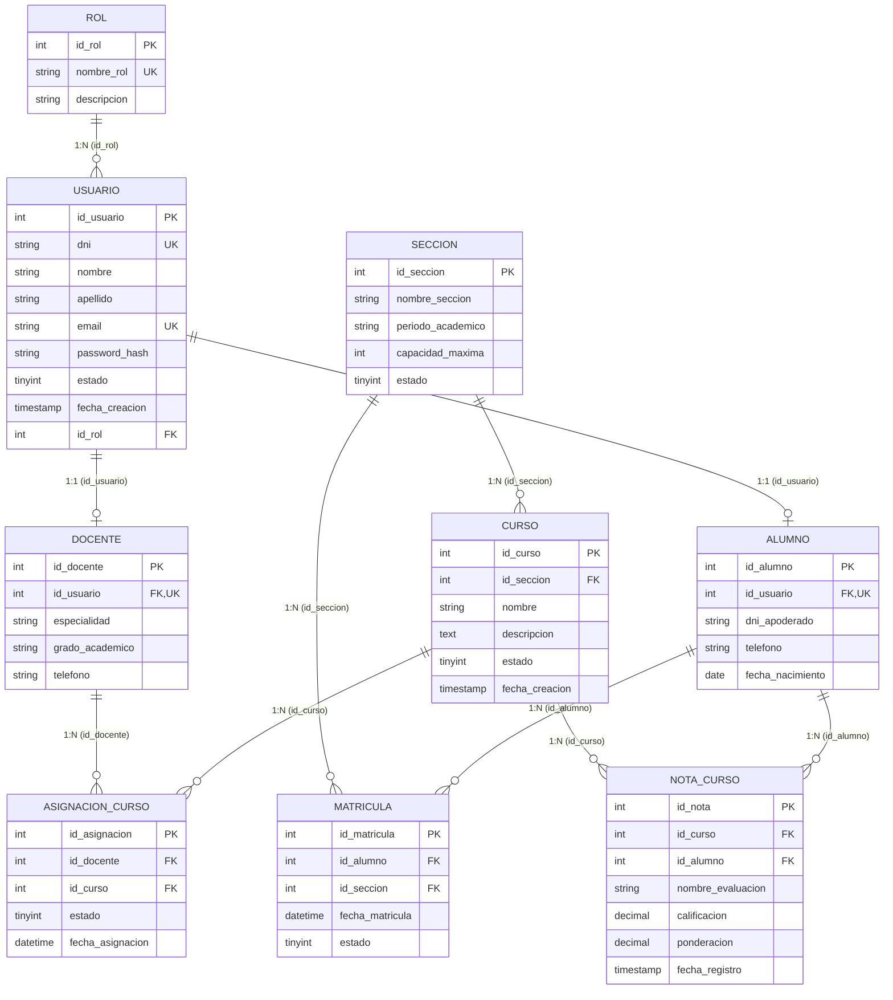

# 🎓 IDAT - BACKEND REST API (SISTEMA DE GESTIÓN ESCOLAR)

> **Unidad Didáctica:** Desarrollo de Interfaces 3  
> **Tecnologías:** Node.js (v18+), Express, MySQL 8 / MariaDB (InnoDB), JWT, BcryptJS, CORS  
> **Puerto por defecto:** `http://localhost:9090`  
> **Base de Datos:** `bd_escolar` (9 Tablas Relacionales con Integridad Referencial)

---

## 📌 Tabla de Contenidos
1. [Descripción General](#-1-descripción-general)
2. [Diagrama de Base de Datos y Entidades](#-2-diagrama-de-base-de-datos-y-entidades)
3. [Requisitos y Configuración](#-3-requisitos-y-configuración)
4. [Puesta en Marcha Rápida](#-4-puesta-en-marcha-rápida)
5. [Credenciales de Prueba y Roles (RBAC)](#-5-credenciales-de-prueba-y-roles-rbac)
6. [Catálogo Completo de Endpoints y Ejemplos JSON](#-6-catálogo-completo-de-endpoints-y-ejemplos-json)
7. [Pruebas Rápidas con cURL](#-7-pruebas-rápidas-con-curl)
8. [Estructura del Proyecto](#-8-estructura-del-proyecto)
9. [Integración con Frontend Angular](#-9-integración-con-frontend-angular)

---

## 📖 1. Descripción General

Este backend provee una **API RESTful modular de alto rendimiento** diseñada para gestionar el ecosistema académico de una institución escolar: autenticación con tokens **JWT**, gestión de usuarios por roles, control de docentes, alumnos, secciones académicas, cursos, matrículas, asignaciones docentes y cálculo automatizado de promedios ponderados y estados académicos.

---

## 🗄️ 2. Diagrama de Base de Datos y Entidades

El backend interactúa directamente con el esquema relacional de 9 tablas:



---

## ⚙️ 3. Requisitos y Configuración

### Requisitos:
- **Node.js:** v18.0.0 o superior
- **MySQL / MariaDB:** v8.0+ (activo en puerto 3306)

### Archivo `.env`
Crea o edita el archivo `.env` en la raíz de la carpeta `backend/`:

```env
# Puerto del servidor
PORT=9090
NODE_ENV=development

# Configuración de MySQL
DB_HOST=localhost
DB_PORT=3306
DB_USER=root
DB_PASSWORD=tu_contraseña_mysql
DB_NAME=bd_escolar

# JSON Web Token
JWT_SECRET=super_secret_idat_jwt_key_2026_academic_portal
JWT_EXPIRES_IN=24h
```

---

## 🚀 4. Puesta en Marcha Rápida

Abre una terminal en la carpeta `backend/` y sigue estos pasos:

```bash
# 1. Instalar dependencias
npm install

# 2. Crear la base de datos y las 9 tablas en MySQL
npm run db:init

# 3. Poblar datos de prueba (usuarios, cursos, notas)
npm run seed

# 4. Iniciar el servidor en modo desarrollo (recarga automática con nodemon)
npm run dev
```

> **Nota:** También puedes importar directamente el script [`bd_escolar.sql`](file:///d:/Interfaces03/bd_escolar.sql) en tu gestor MySQL (phpMyAdmin, Workbench, DBeaver) para crear la base de datos y cargar los datos con un solo clic.

---

## 🔑 5. Credenciales de Prueba y Roles (RBAC)

Las contraseñas están encriptadas con **Bcrypt** en la base de datos:

| Rol | Correo Institucional | Contraseña | Alcance y Permisos |
| :--- | :--- | :--- | :--- |
| **ADMINISTRADOR** | `admin@idat.edu.pe` | `admin123` | Acceso total: CRUD de usuarios, cursos, secciones y reportes. |
| **DOCENTE / PROFESOR** | `profesor@idat.edu.pe` | `prof123` | Acceso académico: Gestión de cursos asignados y registro de notas. |
| **ESTUDIANTE / ALUMNO** | `estudiante@idat.edu.pe` | `est123` | Acceso de consulta: Catálogo de cursos, matrícula y boleta de notas. |

---

## 📑 6. Catálogo Completo de Endpoints y Ejemplos JSON

Todos los endpoints tienen como prefijo: `http://localhost:9090/api`

### 1️⃣ Autenticación (`/api/auth`)

#### `POST /api/auth/login`
- **Público**: Inicia sesión y retorna token JWT y datos de sesión.
- **Request Body:**
```json
{
  "email": "admin@idat.edu.pe",
  "clave": "admin123"
}
```
- **Response (200 OK):**
```json
{
  "success": true,
  "message": "Autenticación exitosa",
  "token": "eyJhbGciOiJIUzI1NiIsIn...",
  "expiraEn": 86400,
  "usuario": {
    "id": 1,
    "nombre": "Alexander Director General",
    "email": "admin@idat.edu.pe",
    "rol": "ADMIN",
    "dni": "70000001",
    "avatar": "https://ui-avatars.com/api/?name=Alexander+Director+General"
  }
}
```

#### `GET /api/auth/profile`
- **Headers:** `Authorization: Bearer <token>`
- **Response (200 OK):** Detalle completo del perfil autenticado con datos de usuario, docente o alumno.

---

### 2️⃣ Usuarios (`/api/usuarios`)

| Método | Ruta | Descripción |
| :--- | :--- | :--- |
| `GET` | `/api/usuarios` | Lista todos los usuarios con roles y perfiles. |
| `GET` | `/api/usuarios/:id` | Obtiene un usuario específico por ID. |
| `POST` | `/api/usuarios` | Registra un nuevo usuario con hash de contraseña. |
| `PUT` | `/api/usuarios/:id` | Actualiza datos, contraseña o estado del usuario. |
| `DELETE` | `/api/usuarios/:id` | Elimina un usuario del sistema. |

- **Ejemplo de creación (`POST /api/usuarios`):**
```json
{
  "nombreCompleto": "Rodrigo Silva Morales",
  "email": "rsilva@idat.edu.pe",
  "clave": "idat2026",
  "codigoInstitucional": "70000099",
  "rol": "DOCENTE",
  "telefono": "987654321",
  "estado": true
}
```

---

### 3️⃣ Cursos y Asignaciones (`/api/cursos`)

| Método | Ruta | Descripción |
| :--- | :--- | :--- |
| `GET` | `/api/cursos` | Lista cursos con sección, aforo, cupos y docente asignado. |
| `GET` | `/api/cursos/:id` | Detalle del curso. |
| `POST` | `/api/cursos` | Crea un curso y asigna sección y docente. |
| `PUT` | `/api/cursos/:id` | Modifica información del curso o reasigna docente. |
| `DELETE` | `/api/cursos/:id` | Elimina el curso. |
| `GET` | `/api/cursos/:cursoId/matriculas` | Estudiantes inscritos con sus notas (para el profesor). |
| `POST` | `/api/cursos/:cursoId/notas` | Registro masivo de evaluaciones (EC1, EC2, EC3, EF). |

- **Ejemplo de creación (`POST /api/cursos`):**
```json
{
  "nombre": "Arquitectura en la Nube con AWS",
  "descripcion": "Diseño de soluciones escalables, Serverless y contenedores Docker.",
  "id_seccion": 1,
  "docenteId": 1,
  "estado": true
}
```

---

### 4️⃣ Matrículas e Inscripciones (`/api/matriculas`)

| Método | Ruta | Descripción |
| :--- | :--- | :--- |
| `GET` | `/api/matriculas` | Consulta matrículas (filtros: `?estudianteId=3`, `?seccionId=1`). |
| `POST` | `/api/matriculas` | Matricula a un estudiante en una sección/curso. |
| `POST` | `/api/matriculas/desmatricular` | Anula la matrícula de un estudiante. |
| `PUT` | `/api/matriculas/:matriculaId/notas` | Actualiza notas de una matrícula. |

- **Ejemplo de matrícula (`POST /api/matriculas`):**
```json
{
  "estudianteId": 3,
  "cursoId": 2
}
```

---

### 5️⃣ Calificaciones y Boletas (`/api/notas`)

- **`POST /api/notas/curso/:cursoId`**:
```json
[
  {
    "id_alumno": 1,
    "notaEC1": 18,
    "notaEC2": 17,
    "notaEC3": 19,
    "notaEF": 18
  }
]
```

- **`GET /api/notas/estudiante/:estudianteId`**:
Retorna la **boleta consolidada** del estudiante con cálculo automático del promedio ponderado:
$$\text{Promedio} = (\text{EC1} \times 0.20) + (\text{EC2} \times 0.20) + (\text{EC3} \times 0.20) + (\text{EF} \times 0.40)$$
y el estado académico (`APROBADO` $\ge 12.5$ / `DESAPROBADO` $< 12.5$ / `EN_CURSO`).

---

### 6️⃣ Secciones Académicas (`/api/secciones`)

| Método | Ruta | Descripción |
| :--- | :--- | :--- |
| `GET` | `/api/secciones` | Lista secciones con total de matriculados y cupos disponibles. |
| `POST` | `/api/secciones` | Crea una nueva sección académica. |
| `PUT` | `/api/secciones/:id` | Modifica nombre, periodo o capacidad. |
| `DELETE` | `/api/secciones/:id` | Elimina una sección. |

---

### 7️⃣ Dashboard y Métricas (`/api/dashboard/metrics`)

- **`GET /api/dashboard/metrics`**:
```json
{
  "success": true,
  "data": {
    "usuarios": {
      "totalUsuarios": 5,
      "totalAdmins": 1,
      "totalDocentes": 2,
      "totalAlumnos": 2,
      "totalActivos": 5
    },
    "cursos": {
      "totalCursos": 4,
      "totalCursosActivos": 4
    },
    "secciones": {
      "totalSecciones": 3,
      "capacidadTotal": 95
    },
    "matriculas": {
      "totalMatriculas": 3,
      "totalMatriculasActivas": 3
    },
    "estadisticas": {
      "promedioGeneral": 16.86,
      "totalEvaluaciones": 7
    }
  }
}
```

---

## 🧪 7. Pruebas Rápidas con cURL

#### 1. Probar Estado del Servicio (Health Check):
```bash
curl -X GET http://localhost:9090/api/health
```

#### 2. Iniciar Sesión (Login):
```bash
curl -X POST http://localhost:9090/api/auth/login ^
  -H "Content-Type: application/json" ^
  -d "{\"email\":\"admin@idat.edu.pe\",\"clave\":\"admin123\"}"
```

#### 3. Consultar Cursos:
```bash
curl -X GET http://localhost:9090/api/cursos
```

#### 4. Consultar Métricas del Dashboard:
```bash
curl -X GET http://localhost:9090/api/dashboard/metrics
```

---

## 📁 8. Estructura del Proyecto

```text
backend/
├── .env                         # Variables de entorno locales
├── .env.example                 # Plantilla de variables
├── package.json                 # Dependencias y scripts de ejecución
├── README.md                    # Manual y documentación técnica completa
└── src/
    ├── config/
    │   └── db.js                # Conexión MySQL con Pool y soporte de Promesas
    ├── database/
    │   ├── initDb.js            # Inicializador DDL de base de datos y 9 tablas
    │   └── seed.js              # Script DML con datos demo y hashes bcrypt
    ├── middlewares/
    │   ├── auth.middleware.js   # Interceptor de JWT y RBAC (Admin, Docente, Alumno)
    │   └── error.middleware.js  # Manejador global de errores y rutas 404
    ├── controllers/             # Controladores de lógica de negocio (9 entidades)
    │   ├── auth.controller.js
    │   ├── usuario.controller.js
    │   ├── docente.controller.js
    │   ├── alumno.controller.js
    │   ├── seccion.controller.js
    │   ├── curso.controller.js
    │   ├── matricula.controller.js
    │   ├── asignacion.controller.js
    │   ├── nota.controller.js
    │   └── dashboard.controller.js
    ├── routes/                  # Enrutamiento modular REST
    │   ├── auth.routes.js
    │   ├── usuario.routes.js
    │   ├── docente.routes.js
    │   ├── alumno.routes.js
    │   ├── seccion.routes.js
    │   ├── curso.routes.js
    │   ├── matricula.routes.js
    │   ├── asignacion.routes.js
    │   ├── nota.routes.js
    │   ├── dashboard.routes.js
    │   └── index.js             # Ruteador maestro
    ├── app.js                   # Configuración de Express, CORS y Morgan
    └── server.js                # Punto de entrada HTTP en puerto 9090
```

---

## 🌐 9. Integración con Frontend Angular

El backend está configurado para comunicarse de forma transparente con el frontend en Angular ubicado en `DAA2-S11-Ejemplo-Angular`:

- **CORS Habilitado**: Acepta peticiones desde `http://localhost:4200` y cualquier origen.
- **DTOs Compatibles**: Los modelos JSON coinciden exactamente con las interfaces TypeScript de Angular (`Usuario`, `Curso`, `Matricula`, `AuthResponse`).
- **Autenticación con JWT**: Compatible con el `AuthInterceptor` de Angular mediante cabecera `Authorization: Bearer <token>`.
